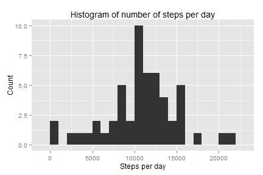

# Reproducible Research: Peer Assessment 1

In this assignment we have been asked to write a report that answers the questions detailed below. The entire assignement must be completed in a single R markdown document that can be processed by knitr and be transformed into an HTML file. The present file represents the mentioned file.

First, let's make sure that the code is always included in the report by default.


```r
library(knitr)
opts_chunk$set(echo = TRUE)
```


## Getting the data
The first thing is to check if the zip file has already been downloaded. If not, download it.

```r
url <- "https://d396qusza40orc.cloudfront.net/repdata%2Fdata%2Factivity.zip"
zip.file <- "activity.zip"

if(!file.exists(zip.file)) {
    download.file(url, destfile = zip.file)
    }
```

If the data is not unzipped yet, extract it to the current directory.

```r
file <- "activity.csv"

if(!file.exists(file)) {
    unzip(zip.file)
    }
```

## Loading and preprocessing the data

We read the data:

```r
data <- read.csv("activity.csv")
```

Is the data in its correct format?

```r
str(data)
```

```
## 'data.frame':	17568 obs. of  3 variables:
##  $ steps   : int  NA NA NA NA NA NA NA NA NA NA ...
##  $ date    : Factor w/ 61 levels "2012-10-01","2012-10-02",..: 1 1 1 1 1 1 1 1 1 1 ...
##  $ interval: int  0 5 10 15 20 25 30 35 40 45 ...
```

The date variable is read as a factor, not a date. Let's correct that.

```r
data$date <- as.Date(as.character(data$date))
str(data)
```

```
## 'data.frame':	17568 obs. of  3 variables:
##  $ steps   : int  NA NA NA NA NA NA NA NA NA NA ...
##  $ date    : Date, format: "2012-10-01" "2012-10-01" ...
##  $ interval: int  0 5 10 15 20 25 30 35 40 45 ...
```

Ok, that's better. Let's do the homework now.

## What is mean total number of steps taken per day?
Let's first calculate the total number of steps per day. We will use for this the ddply function, that requires the plyr library.

```r
library(plyr)
data.day <- ddply(data, .(date), summarize, sum=sum(steps))
```

Let's plot the histogram with the total number of steps taken per day. We will do it with the ggplot2 library. I have chosen to group measurements in 1000 intervals (option **binwidth=1000**).

```r
library(ggplot2)
graph <- ggplot(data.day, aes(x=sum))
graph <- graph + geom_histogram(binwidth=1000)
graph <- graph + labs(title = "Histogram of number of steps per day",
                      x = "Steps per day", y = "Count")
print(graph)
```

 

Let's see what are the mean and median of the total steps per day.

```r
data.mean <- mean(data.day$sum, na.rm=TRUE)
data.median <- median(data.day$sum, na.rm=TRUE)
```

The mean of the set is 1.0766 &times; 10<sup>4</sup>and its median is 10765.

## What is the average daily activity pattern?
For this question we must first calculate the average number of steps per interval.

```r
data.interval <- ddply(data, .(interval), summarize, avg=mean(steps, na.rm=TRUE))
data.interval.new <- ddply(data.completed, .(interval), summarize, avg=mean(steps, na.rm=TRUE))
```

```
## Error: object 'data.completed' not found
```

Let's see the shape it has over the day. 

```r
graph <- ggplot(data.interval, aes(x=interval, y=avg))
graph <- graph + geom_line()
graph <- graph + labs(title = "Average number of steps per interval and day",
                      x = "Interval", y = "Average steps per day")
print(graph)
```

 

There is a clear spike in the graph. Let's find to which interval it corresponds.

```r
max.interval <- data.interval[data.interval$avg == max(data.interval$avg),][1]
```
The 5-minute interval with the maximum average number of steps, on average across all the days in the data set, is 835. 

## Imputing missing values
There are missing values in the data set, identified with NA values. Let's see how many of those there are.

```r
data.missing <- data[is.na(data$steps),]
nrow(data.missing)
```

```
## [1] 2304
```

That is quite a high number of missing values. Let's try to fill them using the average value per interval for the dataset. This is going to be done directly into a new dataset called data.completed.

```r
data.completed <- data
for (day in unique(data.missing$date)) {
    data.completed[data.completed$date == day, ]$steps <- data.interval$avg
}
```

Let's check we have no missing values now.

```r
nrow(data.completed[is.na(data.completed$steps),])
```

```
## [1] 0
```

Now let's recalculate the mean total number of steps taken per day, as previously done.

Let's first calculate the total number of steps per day.

```r
new.data.day <- ddply(data.completed, .(date), summarize, sum=sum(steps))
```

Let's plot the histogram with the total number of steps taken per day. We will do it with the ggplot2 library.

```r
library(ggplot2)
graph <- ggplot(new.data.day, aes(x=sum))
graph <- graph + geom_histogram(binwidth=1000)
graph <- graph + labs(title = "Histogram of number of steps per day",
                      x = "Steps per day", y = "Count")
print(graph)
```

 

The graph appears to be exactly the same but for an increase of the bar of 10.000-11.000 steps, which is the logical impact of substituting the NA values with the mean values for intervals.

Let's see what are the mean and median of the total steps per day.

```r
new.data.mean <- mean(new.data.day$sum)
new.data.median <- median(new.data.day$sum)
```

The mean of the new set without NAs is 1.0766 &times; 10<sup>4</sup>and its median is 1.0766 &times; 10<sup>4</sup>. In the previous set it was 1.0766 &times; 10<sup>4</sup>and its median is 10765. Similarly, the difference is minimal.

## Are there differences in activity patterns between weekdays and weekends?
We can not reuse any of the previously calculated datasets, so we will create two differenciate weekday and weekend databases with average number of steps per value for both categories. We are going to do the calculations on our brand new completed database without NAs.

Let's first add a column differenciating weekdays and weekends. We use plyr's mutate() function for that.

```r
data.completed <- mutate(data.completed, daytype=ifelse(weekdays(date) %in% c("Saturday", "Sunday"), "weekend", "weekday"))
unique(data.completed$daytype)
```

```
## [1] "weekday" "weekend"
```

```r
str(data.completed$daytype)
```

```
##  chr [1:17568] "weekday" "weekday" "weekday" "weekday" ...
```
Let's make sure the types of day are stored as factors

```r
data.completed$daytype <- factor(data.completed$daytype)
str(data.completed$daytype)
```

```
##  Factor w/ 2 levels "weekday","weekend": 1 1 1 1 1 1 1 1 1 1 ...
```

Now we calculate average steps per interval for weekend and weekday days. Instead of creating new variables, we add our results to the existing data.interval dataset. This way we keep similar data together. As we have used this dataset to fill the missing NA values, its average values will be the exactly same with data and data.completed datasets, and thus we do not introduce any error by directly using it.

```r
data.interval$weekday <- ddply(data.completed[data.completed$daytype == "weekday",], .(interval), summarize, avg_weekday=mean(steps, na.rm=TRUE))[,2]
data.interval$weekend <- ddply(data.completed[data.completed$daytype == "weekend",], .(interval), summarize, avg_weekend=mean(steps, na.rm=TRUE))[,2]
```

Now let's plot our results. In order to have a faceted plot such as the one in the graph we need to use the facet_* functions. We could have also done it with two different graphs in a grid structure, which would have fit better with the type of table calculated above, but I just want to avoid losing any points in the peer-review :-)

For this, let's first melt the data.

```r
library(reshape2)
data.graph <- melt(data.interval, id=c("interval", "avg"))
```

Now we can plot it.

```r
graph <- ggplot(data.graph, aes(x=interval, y=value))
graph <- graph + facet_wrap(~variable, ncol=1)
graph <- graph + geom_line()
graph <- graph + labs(title = "Average number of steps per interval and day",
                      x = "Interval", y = "Average steps per day")
print(graph)
```

 

And that's it!
